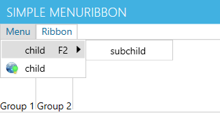
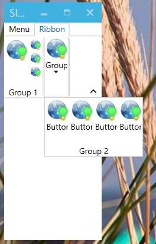

## MenuRibbon.WPF
A WPF control library providing a single control that can act as a Menu bar, a Ribbon bar, or even both at the same time.

Source on GitHub: http://github.com/superlloyd/MenuRibbon

All the `MenuRibbon.WPF` classes can be referenced in XAML by the following namespace declaration:
`http://schemas.menuribbon.net/xaml`

### Dependencies
- [MahApps.Metro](http://mahapps.com) 
- [Rx-Linq](https://www.nuget.org/packages/Rx-Linq) 

This control has been tested and developed to provide the distraction free look of Word 2013. **MahApps.Metro** provided this look for WPF applications.

**Rx-Linq** is used to handle mouse events internally. The class `WPFx` has multiple extension methods returning `Observable` for various mouse events, such `MouseDown`, `MouseClick`, `MouseDrag`, etc...


### Main Classes
- **MenuRibbon** Top level container for either `RibbonItem` or `MenuItem`.
- **RibbonItem** An `HeaderedContentControl` subclass which can contain a `RibbonBar`.
  - **RibbonBar** An `ItemsControl` for `RibbonGroup`.
  - **RibbonGroup** An `HeaderedItemsControl` for any control, preferable `ItemsButton` though.
- **MenuItem** An `HeaderedItemsControl` that show its children in a popup. Should be shown either in a `MenuRibbon` or `ItemsButton` to popup its children successfully. Also can contain any kind of child control, not just other `MenuItem`.
- **ItemsButton** Another top level container for `MenuItem`, can be used anywhere.


### Examples
Let's show some small but common use case to get the code started with `MenuRibbon.WPF`.

#### Setup a simple MenuRibbon
Below is the source code for a very minimalistic ribbon. Note that the window is of type `MetroWindow`.

```XML
<metro:MetroWindow 
	x:Class="TestApp.Window1"
	xmlns="http://schemas.microsoft.com/winfx/2006/xaml/presentation"
	xmlns:x="http://schemas.microsoft.com/winfx/2006/xaml"
	xmlns:metro="http://metro.mahapps.com/winfx/xaml/controls"
	xmlns:mr="http://schemas.menuribbon.net/xaml"
	Title="Simple MenuRibbon" Height="350" Width="400">
	<Grid>
		<Grid.RowDefinitions>
			<RowDefinition Height="Auto"/>
			<RowDefinition Height="*"/>
		</Grid.RowDefinitions>
		<mr:MenuRibbon>
			<mr:MenuItem Header="Menu">
				<mr:MenuItem Header="child" InputGestureText="F2" >
					<mr:MenuItem Header="subchild"/>
				</mr:MenuItem>
				<mr:MenuItem Header="child">
					<mr:MenuItem.Icon>
						<Image Width="16" Source="connected_48.png"/>
					</mr:MenuItem.Icon>
				</mr:MenuItem>
			</mr:MenuItem>
			<mr:RibbonItem Header="Ribbon">
				<mr:RibbonBar>
					<mr:RibbonGroup Header="Group 1">
					</mr:RibbonGroup>
					<mr:RibbonGroup Header="Group 2">
					</mr:RibbonGroup>
				</mr:RibbonBar>
			</mr:RibbonItem>
		</mr:MenuRibbon>
	</Grid>
</metro:MetroWindow>
```
This will produce that window:


If the Ribbon is expanded and the menu open you will get that:




#### Using custom control inside a Menu
Let's add a Word like header in the menu!
First let's define an header style:
```XML
<Style x:Key="HeaderStyle"  TargetType="TextBlock">
	<Setter Property="Background" Value="#E8E8E8"/>
	<Setter Property="Padding" Value="6,3"/>
	<Setter Property="FontWeight" Value="Bold"/>
	<Setter Property="Foreground" Value="#6D6D6D"/>
</Style>
```
Then add a `TextBlock` with that style to the menu
```XML
<mr:MenuItem Header="Menu">
	<mr:MenuItem Header="child" InputGestureText="F2" ><!-- children --></mr:MenuItem>
	<TextBlock Style="{StaticResource HeaderStyle}">My Header</TextBlock>
	<mr:MenuItem Header="child"><!-- children --></mr:MenuItem>
</mr:MenuItem>
```
And voila, a nice header!


#### Using data binding with a MenuItem
As it is a somewhat non standart `ItemsControl` (it has multiple container item type) the `ItemTemplate` property doesn't use `HierarchicalItemsTemplate`, instead just use a normal `DataTemplate` of a `MenuItem`.
Here is how one MenuItem with databing is set in the sample:
```XML
<mr:MenuItem Header="DataContextList" ItemsSource="{Binding RandomList, ElementName=root}">
	<mr:MenuItem.ItemTemplate>
		<DataTemplate>
			<mr:MenuItem Header="{Binding Header}"
							InputGestureText="{Binding Shortcut}"
							ItemsSource="{Binding Children}">
			</mr:MenuItem>
		</DataTemplate>
	</mr:MenuItem.ItemTemplate>
</mr:MenuItem>
```

#### Resizing Ribbon Bar
A `RibbonItem` could have any kind of content. However if the content is a `RibbonBar` which contains multiple `RibbonGroup` which contains mulitple `ItemsButton` it will resize like the Microsoft Ribbon.

[MS-Ribbon Layout and Resizing](http://msdn.microsoft.com/en-us/library/ff701790(v=vs.110).aspx)

- A `RibbonBar` could have a `GroupSizeReductionOrder` which specifies the name of the `RibbonGroup` in the order they must be reduced.
- A `RibbonGroup` has a `GroupSizeDefinitions` property which hold a collection of `RibbonGroupSizeDefinition`, one for each (progressively smaller) size.
- A `RibbonGroupSizeDefinition` either contains a list of `RibbonControlSizeDefinition` (one for each of its `RibbonGroup`'s control at this size level), or the property `IsCollapsed` is true.
- A `RibbonControlSizeDefinition` has various properties that alter the look and size of a single `ItemsButton`. It can be set explicitely or by the `RibbonGroup` when resized.

Here is a simple `RibbonBar` setup.
```XML
<mr:RibbonItem Header="Ribbon">
	<mr:RibbonBar GroupSizeReductionOrder="gr2,gr1">
		<mr:RibbonGroup x:Name="gr1" Header="Group 1">
			<mr:RibbonGroup.GroupSizeDefinitions>
				<!-- largest size all button big -->
				<mr:RibbonGroupSizeDefinition>
					<mr:RibbonControlSizeDefinition IconSize="Large" IsHeaderVisible="True"/>
					<mr:RibbonControlSizeDefinition IconSize="Large" IsHeaderVisible="True"/>
					<mr:RibbonControlSizeDefinition IconSize="Large" IsHeaderVisible="True"/>
					<mr:RibbonControlSizeDefinition IconSize="Large" IsHeaderVisible="True"/>
				</mr:RibbonGroupSizeDefinition>
				<!-- 3 right most buttons are collapsed into small buttons -->
				<mr:RibbonGroupSizeDefinition>
					<mr:RibbonControlSizeDefinition IconSize="Large" IsHeaderVisible="True"/>
					<mr:RibbonControlSizeDefinition IconSize="Small" IsHeaderVisible="True"/>
					<mr:RibbonControlSizeDefinition IconSize="Small" IsHeaderVisible="True"/>
					<mr:RibbonControlSizeDefinition IconSize="Small" IsHeaderVisible="True"/>
				</mr:RibbonGroupSizeDefinition>
				<!-- remove text on small buttons -->
				<mr:RibbonGroupSizeDefinition>
					<mr:RibbonControlSizeDefinition IconSize="Large" IsHeaderVisible="True"/>
					<mr:RibbonControlSizeDefinition IconSize="Small" IsHeaderVisible="False"/>
					<mr:RibbonControlSizeDefinition IconSize="Small" IsHeaderVisible="False"/>
					<mr:RibbonControlSizeDefinition IconSize="Small" IsHeaderVisible="False"/>
				</mr:RibbonGroupSizeDefinition>
				<!-- collapse the all group to 1 popup -->
				<mr:RibbonGroupSizeDefinition IsCollapsed="True"/>
			</mr:RibbonGroup.GroupSizeDefinitions>
			<mr:ItemsButton Header="Button 1" 
								LargeIcon="{mr:Image connected_48.png, Width=32, Height=32}"
								SmallIcon="{mr:Image connected_48.png}"
								/>
				<!-- 3 more similar buttons -->
		</mr:RibbonGroup>
		<mr:RibbonGroup x:Name="gr2" Header="Group 2">
			<!-- same setup as Group 1 -->
		</mr:RibbonGroup>
	</mr:RibbonBar>
</mr:RibbonItem>
```
And voila, this is a properly resizing ribbon:


All the way down to collapsed group:




### TODO
- More work on keyboard - mouse - focus interaction
- Better support for split buttons (`ItemsButton.IsSplitButton = true`).
- KeyTips.
- NuGet package.
- Galleries.


### Contributions

If you've improved MenuRibbon.WPF and think that other people would enjoy it, submit a pull request at:
http://github.com/superlloyd/MenuRibbon
